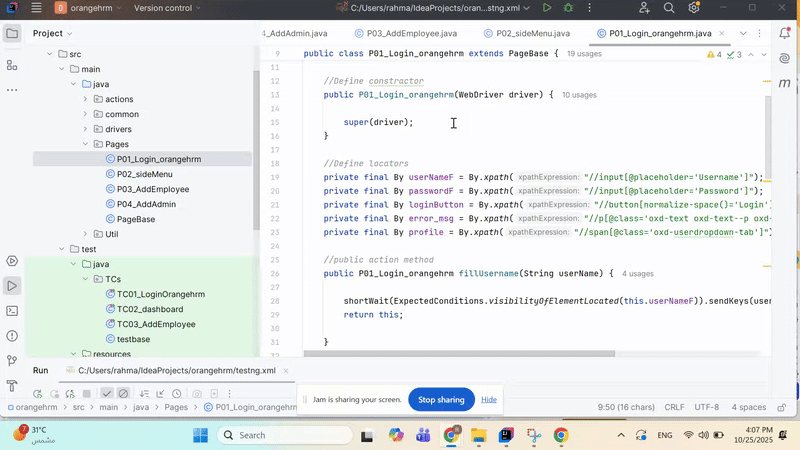

# OrangeHRM Selenium Automation

Automated testing framework for OrangeHRM Demo application using Java and Selenium WebDriver.

## 🎯 Overview

This project provides automated test scripts for the OrangeHRM demo application, focusing on user management functionality including adding users, selecting roles, and managing employee data.

**Application Under Test:** https://opensource-demo.orangehrmlive.com/

### Login Tests
- ✅ Successful login with valid credentials
- ✅ Failed login with invalid credentials
- ✅ Logout functionality

### User Management Tests
- ✅ Add new user with random role selection
- ✅ Select employee from autocomplete dropdown
- ✅ Fill user form with required fields
- ✅ Save and verify user creation
- ✅ Search for existing users

### Dropdown Handling
- ✅ Select random option from User Role dropdown (excluding "-- Select --")
- ✅ Select first option from Employee Name autocomplete
- ✅ Select Status dropdown values

## 

---

## ⚙️ Tech Stack & Tools 🔑 Features
🛠 Framework Features
☕ **Java Language** – Strongly typed, object-oriented, and widely used for test automation.
🧩 **Page Object Model (POM)** – Clean, modular, and reusable code structure for better maintainability.
🧪 **TestNG Integration** – Structured test execution with grouping, parallel runs, and reporting.
📂 **Data-Driven Testing (JSON)** – Flexible test data management for scalability and variation handling.
🎨 **Fluent Design Pattern** – Enhances code readability with chainable, human-like test steps. "# OrangeHRM-" 
